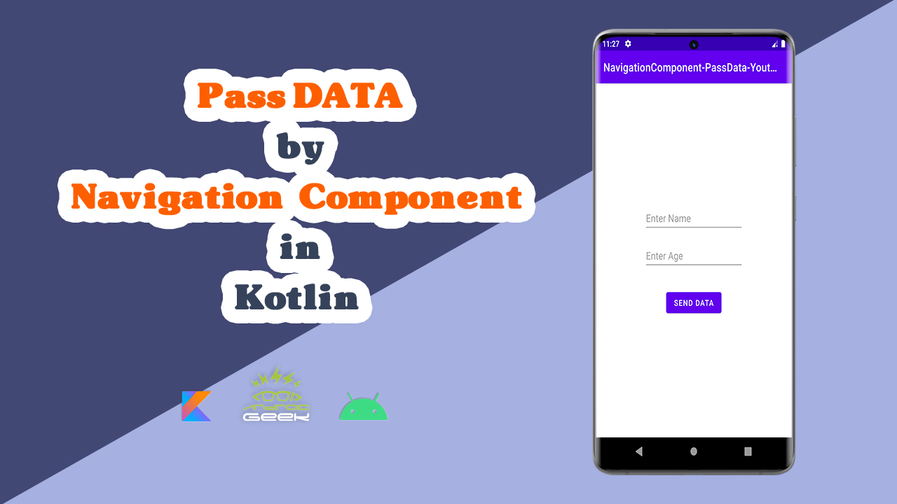

# PassData-NavigationComponent-Youtube
</a>

YouTube Video :
   

 

Medium's Article :
 
https://medium.com/@ezatpanah/pass-data-between-destinations-by-navigation-component-in-kotlin-372d2af1fa76

✨ Join Medium to read thousands of valuable stories ✨
 
https://medium.com/@ezatpanah/membership
